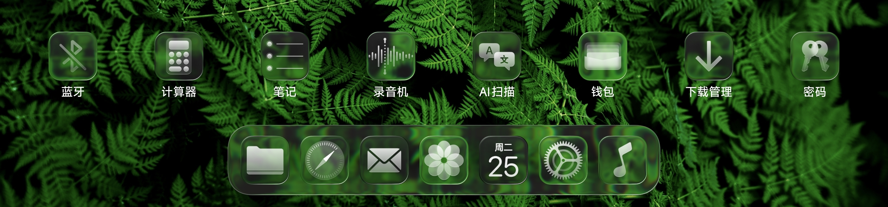

# LiquidDock
<p align="center">
  
</p>

LiquidDock 是一个面向 HyperOS 3 平板系统桌面 的 LSPosed / libxposed API 101 模块，用于实现系统桌面 UI 的液态玻璃，并自定义 Dock 外观、桌面网格与工作台布局。


## 主要功能

- **液态玻璃改造**：针对 HyperOS 3.0.307+，使用系统 PassBlur 方法、GLES、Prismal 项目液态玻璃模型完成折射、色散、镜面、焦散、高光、描边等光学效果。支持 Dock、小组件（部分支持）、文件夹、桌面图标（需配合透明图标主题），可自定义尺寸与圆角。
- **自定义桌面布局**：新增 8x4、10x6 两种桌面布局，自定义横竖屏边距/间距、页面指示器位置。
- **Dock 几何自定义**：宽度、高度、底部偏移、图标间距、圆角、背景模糊强度的自定义。
- **Dock 描边**：为 Dock 增加描边，可自定义颜色、透明度。
- **Dock 阴影**：自定义 Dock 阴影，包括描边阴影和底部阴影。
- **原生 Dock 自定义**：在未启用 zero-copy glass 的 native 路径中继续支持 blur radius、独立 Dock shadow、系统原生 shadow 抑制与 squircle 相关外观控制。
- **工作台模式**：支持 8x4 桌面布局，同样支持布局自定义。
- **Dock 分隔线**：可调宽度、高度比例、垂直偏移、颜色与透明度。
- **多任务界面自定义**：支持自定义多任务界面背景模糊度

<p align="center">
  
</p>

## 注入边界

```text
com.miui.home 系统桌面
```

## 兼容性

液态玻璃效果针对 **HyperOS 3.0.307+** 版本的 HotSeats material 与 SurfaceFlinger PassBlur 私有接口实现，依赖 ROM 中存在对应 vendor class 和隐藏 SurfaceControl transaction API。ROM 更新后如果这些私有接口发生变化，液态玻璃功能将按失效。

非玻璃功能的可用性仍取决于对应 HyperOS Launcher 类和方法是否存在。

## 构建

使用：

- Android SDK / compileSdk 37；
- JDK 17；
- libxposed API 101；
- Gradle 自动解析 `io.github.libxposed:api` / `service` 依赖。

Release：

```bash
ANDROID_HOME=/path/to/Android ./gradlew assembleRelease --no-daemon
```

Debug：

```bash
./gradlew testDebugUnitTest --stacktrace
./gradlew assembleDebug --stacktrace
```

Debug 与 Release 都经过 Android Gradle Plugin optimization / shrinker 路径。APK 位于 `build/outputs/apk/` 下对应构建类型目录。

## 分支

- **`main`** — 当前开发主线。
- **`archive/1.x`** — 使用屏幕捕获方法的旧实现。

## 免责声明

本项目为非官方社区项目，与小米公司无关。"HyperOS" 与 "MIUI" 为其所有者商标，此处仅用于兼容性描述。

本项目仅供学习与研究使用。使用者自行承担使用风险；本项目禁止商用。

## 感谢

- **Prismal** — Liquid Glass 光学模型与 Shader 参数设计参考。
- **LSPosed / libxposed** — Hook API 与模块运行框架。
- **HyperCeiler** — HyperOS 模块工程实践参考。
- **HyperLight** — 旧版本屏幕捕获设计参考。

## 开源许可

本项目基于 [GPL-3.0](LICENSE) 许可开源。
