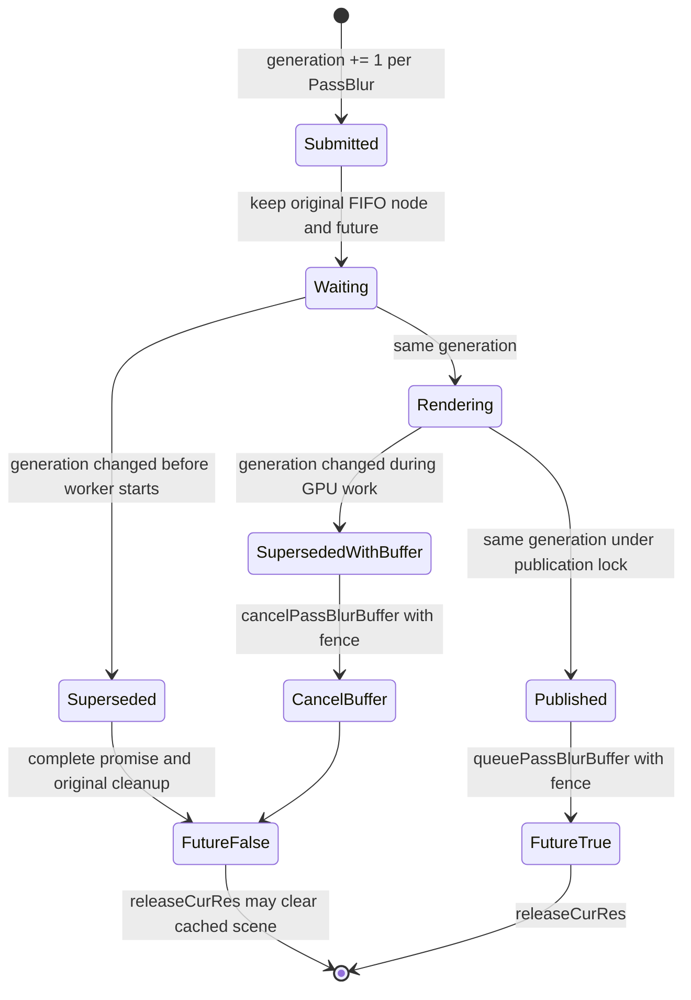

# HyperOS PassBlur native scheduler: verified baseline and Phase 1 design

This investigation targets the `Libs` release of `yu4032/hyperos-analysis`, commit
`2e2856e172d5faba872ab776dd79ddb0576d6178` on
`analysis/passblur-gfx-libs`. The release archive SHA256 is
`57e25e06f70aa3e3da98dbeb16fbcc6e6e9d2ecd541f96568dc043e91804282f`.
Its `libsurfaceflinger.so` is 11,577,024 bytes, SHA256
`407be876ceadc0ac5254abcc357ed2c196fbbf6179c940bc75d1ddf05f63ae32`,
ELF64 little-endian AArch64, GNU build ID
`39691db140edc0663fab2fde2475c091`. The library pulled on 2026-09-25
from `/system_ext/lib64/libsurfaceflinger.so` on OS3.0.310.0.WAOCNXM has
the same SHA256. No patched library has been installed.

The analysis tool loaded this ELF at image base `0x100000`. Every address in
`functions.tsv` and the pseudocode is therefore **ELF virtual address +
0x100000**. For example, Ghidra `0x6591b0` is ELF `0x5591b0`.
`native/passblur/compatibility.json` records both coordinates, function byte
hashes, and entry bytes. `verify_binary.py` translates ELF addresses through
the executable `PT_LOAD`; neither tool assumes that a Ghidra address is a file
offset. The executable segment is `R E` (`0x2e8000` through `0xa4f150`);
`GNU_RELRO` covers `0xa50000` through `0xaa3000`. `readelf -n` reports no
GNU BTI/PAC property note. That does not prove all individual call sites are
free of branch-target or pointer-authentication constraints.

## Verified call path

| Ghidra address | ELF address | Function and evidence |
| --- | --- | --- |
| `0x5215e0`, `0x521730` | `0x4215e0`, `0x421730` | `PassBlur` constructors; initialize `+0xf8` from `persist.sys.sf.draw.texture`, default 30 ms |
| `0x5222e0` | `0x4222e0` | `setUpdateTextureFlag`; writes flag and scale, resets queue count |
| `0x522380` | `0x422380` | `setForceRefresh`; only writes an expiry at `+0x70` |
| `0x448340`, `0x448b70` | `0x348340`, `0x348b70` | `BackgroundExecutor` creates one `passBlur` thread; enqueue allocates a `0x220` node and posts its semaphore |
| `0x4491b0`, `0x449630` | `0x3491b0`, `0x349630` | `LocklessQueue::pop` reverses the producer chain to FIFO; one worker drains it |
| `0x64d2d0` | `0x54d2d0` | `drawPassBlurIfNeed` updates `PassBlur+0xa8` before calling `drawPassBlurInternal` |
| `0x64eba0` | `0x54eba0` | Creates a separate `future<bool>`, copies LayerSettings and a `0x208` closure for each submission |
| `0x6591b0` | `0x5591b0` | Closure copies/filters layers, dequeues, renders, queues or cancels, and resolves its promise |
| `0x64e4b0` | `0x54e4b0` | `releaseCurRes` consumes every stored future and clears resources |
| `0x571750` | `0x471750` | Scheduler reads the active pacesetter display mode; reserved for Phase 2 |

The evidence is the matching binary plus
`query-native/passblur-gfx-libs/libsurfaceflinger.so/{functions.tsv,calls.tsv,pseudocode/}`
in the cited analysis commit. `drawPassBlurIfNeed` pseudocode lines 625–656
show the time gate, and 727–742 show `lastDraw` updated before job submission.
At scale 1, the 30 ms threshold is divided by two: 15 ms is about 2.48
display periods at 165 Hz. This is a submission gate, not worker backpressure.

```mermaid
stateDiagram-v2
    [*] --> SourceEvaluation
    SourceEvaluation --> Skipped: no source change or pacing gate
    SourceEvaluation --> Snapshot: eligible; lastDraw := now
    Snapshot --> FIFO: future + copied scene + closure
    FIFO --> Worker: oldest node first
    Worker --> Dequeued: current buffer absent
    Dequeued --> RenderEngine
    RenderEngine --> Queued: queuePassBlurBuffer
    RenderEngine --> Cancelled: original error / geometry guard
    Queued --> FutureTrue
    Cancelled --> FutureFalse
    FutureTrue --> ReleaseCurRes
    FutureFalse --> ReleaseCurRes
```

`setAsyncMode(true)` on the output BufferQueue cannot remove a scene snapshot
that is still waiting in the worker FIFO. The single-worker FIFO and absence
of a generation comparison are visible in `0x448b70.c`, `0x4491b0.c`,
`0x449630.c`, and `0x6591b0.c`.

## PassBlur object field map

All offsets are relative to the `PassBlur*`, for this binary only. A field
without a verified meaning is not available for reuse.

| Offset | Verified meaning | Evidence |
| --- | --- | --- |
| `0x20` | texture native-window interface | dequeue/queue/cancel and `disconnectWin` |
| `0x28..0x38` | include-name vector | ctor/dtor and closure lines 166–183 |
| `0x40..0x50` | exclude-name vector | ctor/dtor and closure lines 185–205 |
| `0x68` | update-texture boolean | `setUpdateTextureFlag` |
| `0x6c` | SurfaceFlinger scale float | `setUpdateTextureFlag`, pacing test |
| `0x70` | force-refresh expiry in ns | `setForceRefresh` |
| `0x78` | blur-window type | `setClientState`, closure geometry test |
| `0xa8` | last submission time in ns | `drawPassBlurIfNeed` lines 635, 729 |
| `0xb4` | dequeue fence fd; reset to `-1` on queue/cancel | three buffer methods and closure lines 686–689 |
| `0xb8`, `0xbc` | dequeued GraphicBuffer width and height | `dequeuePassBlurBuffer` lines 267–270 |
| `0xc0`, `0xc4` | requested source width and height | `drawIfNeed` (`0x649660.c`) lines 789–799, closure geometry check |
| `0xcc` | bounded successful queue count, reset on producer configuration change | queue lines 81–85; `setUpdateTextureFlag` |
| `0xd0`, `0xd8` | active `shared_ptr<ExternalTexture>` object and control block | dequeue, queue, cancel |
| `0xe0`, `0xe8`, `0xf0` | cached ExternalTexture vector begin/end/capacity | dequeue and destructor |
| `0xf8` | configured pacing threshold in ns | constructor, `drawPassBlurIfNeed` |
| `0x100` | initialized to 1 s; additional timing use requires more tracing | constructor |

`dequeuePassBlurBuffer` does nothing when the window is absent or `+0xd0`
already holds a buffer. On a successful native-window dequeue, it obtains a
GraphicBuffer, reuses or creates an ExternalTexture in the cache, stores it at
`+0xd0/+0xd8`, saves the fence at `+0xb4`, and saves buffer dimensions at
`+0xb8/+0xbc`. `queuePassBlurBuffer` sets crop/metadata, queues the active
GraphicBuffer using a duplicated fence, falls back to cancel on queue error,
increments `+0xcc` up to 20, clears the active shared pointer, and resets
`+0xb4` to `-1`. `cancelPassBlurBuffer` duplicates its fence into native-window
cancel, clears the same active pointer and fence field. Both require the
active buffer and native window. The caller's `unique_fd` remains responsible
for closing its original descriptor after the call.

## Closure and future layout

The `0x208` closure allocation in `drawPassBlurInternal` (`0x64eba0.c`
lines 329–413) uses all observed tail bytes: `+0x08..0x18` holds the copied
LayerSettings vector, `+0x20` the count, `+0x28` the LayerFE pointer,
`+0x30` onward the copied DisplaySettings, `+0x1b8/+0x1c0` the promise
wrapper/control block, and `+0x200` the manager pointer. The closure obtains
`PassBlur*` from `*(LayerFE* + 0x10)` and takes a strong reference at
`0x6591b0.c` lines 161–162; it releases it on the common completion path,
lines 854–899. There is no proven spare capture slot for a generation.
`bgDrawPassBlur` moves/copies its `SmallVector<std::function<void()>>`, and
the closure clone helper (`0x65a300.c` lines 139–148) copies the promise
shared-state control block. Therefore a side table keyed by the initial
closure allocation address would lose the worker's cloned job. The actual
promise shared-state pointer (`**(closure + 0x1b8)`) is a candidate stable
per-job key. `native/passblur/latest_only_scheduler.hpp` models a side table
with this key and per-PassBlur state; attaching and erasing it in the
original binary still requires ABI-safe hook points.

`releaseCurRes` (`0x64e4b0.c`) iterates the vector at manager `+0x40..0x48`
and calls `std::__assoc_state<bool>::move` for each future. A false result
enters the `"next Frame, will drawPassBlur again."` branch and destroys the
manager's cached LayerSettings at `+0x88..0x90`; true skips this branch.
The function then clears other frame resources and the future vector. It
does **not** permanently disable PassBlur in this function. False can cause
another scene calculation and cannot be treated as a completely inert result.
The closure sets false for its existing geometry/cancel path and true after
calling `queuePassBlurBuffer`; note that `queuePassBlurBuffer` itself handles
a native-window queue error by cancelling, yet the closure still sets true.
Thus true means the queue path was reached, not guaranteed display delivery.

## Phase 1 insertion analysis and unresolved ABI work

Submission must associate a monotonic generation with the **specific
PassBlur instance** and the particular closure before `bgDrawPassBlur` is
called. The original `bl bgDrawPassBlur@plt` is at ELF `0x54f24c`;
immediately before it, `x1` points to the stack `SmallVector` at `sp+0x230`.
This is a submission-hook candidate, but parsing the variant and preserving
the move/copy semantics still need an adapter proof. The first worker
comparison belongs after it has acquired the
`PassBlur*` but before the expensive LayerSettings filtering. The relevant
ARM64 span starts at ELF `0x559220` (loads LayerFE/PassBlur), with the
`incStrong` call at `0x55923c`. Returning *there* cannot simply branch to the
existing completion tail: the tail destroys vectors initialized after that
point. Disassembly narrows a candidate to ELF `0x5592f0`: both local String8
vectors and the filtered-layer vector have been initialized, while the
layer-filtering loop has not begun. The original no-dequeued-buffer path at
`0x559ad0` sets `w22=0` and branches to the common promise/cleanup tail at
`0x55a13c`. A stale-entry hook could use that same false-result tail only
after validating the full stack/register state and erasing its per-job side
table entry. This is a candidate, not an approved instruction patch.

The second comparison belongs after RenderEngine returns a fence and before
the queue call at ELF `0x55a040` (Ghidra `0x65a040`). The original cancel call
at ELF `0x559ee8` is on a separate geometry/error path and duplicates
`NO_FENCE`; stale-after-render must instead cancel using the RenderEngine
fence, release that fence and `unique_fd`, and complete false. It cannot merely
replace the `bl queuePassBlurBuffer` instruction: ELF `0x55a0d8` later sets
`w22=1` unconditionally before the common completion tail. Both the buffer
action and result assignment require coordinated changes.
Submission and queue publication also need a common per-instance
linearization lock, otherwise a newer request can arrive between an atomic
freshness read and `queuePassBlurBuffer`. GPU work stays outside that lock.

The intended Phase 1 state transitions are:

The first rejection must not call `cancelPassBlurBuffer`, because no buffer
has been dequeued. The second must call it exactly once. Both preserve the
original future vector and closure destructor. The `false` path is a normal
completion with a redraw side effect, not a missing future.

No candidate free field in `PassBlur` or free slot in the closure has been
proved. A production side registry must be registered at construction,
removed at destruction, keyed per PassBlur instance, and make captured
state survive until every closure completes. That requires additional
verified constructor/destructor and closure-lifetime patch sites. The
existing binary provides no built-in native-hook loading mechanism; an APK
JNI library runs in Launcher, not SurfaceFlinger. A trampoline or ELF
extension must also prove branch reach, relocation, unwind, CFI, and
recovery behavior. **Do not install or distribute a modified library based
only on the two call-site addresses above.** `compatibility.json` intentionally
has no active patch sites until this proof exists.

Phase 2 may use `Scheduler::getPacesetterVsyncPeriod` at ELF `0x471750`, but
the stable MiOutputManager → SurfaceFlinger → Scheduler pointer chain is not
yet verified. Phase 1 must not change the 30 ms pacing, queue ABI, shader,
or BufferQueue. Java consumer coalescing is an independent improvement and
must be preserved when the native fork is integrated. As checked on
2026-09-25, PR #241 is closed and unmerged; its PR head is the current
main commit `08a7a494`, so it has no pending diff. The separately fetched
`origin/fix/dock-passblur-frame-latency` branch still ends at `efc5df13`
and its diff contains only consumer frame-signal/coalescing changes. Neither
current PR head nor that branch diff contains a Recents force-refresh boost
to delete. The current main `Miuix307PassBlurTextureView` still delivers
producer callbacks on its GL handler and calls `drawLatestFrame(true)` for
each callback; it does not contain `LatestFrameRenderGate` or an explicit
`eglSwapInterval(1)` call. The old branch contains the gate but likewise no
explicit swap-interval call. The consumer patch therefore still needs a
separate review/integration rather than being represented as already on main.

## Reproduction and recovery boundary

Run `python native/passblur/verify_binary.py <libsurfaceflinger.so>` on the
offline original before any patch design or application. A mismatch in
whole-file SHA, any function SHA, or entry bytes rejects the binary. Keep a
byte-identical backup and do not alter the on-device library while resolving
the ABI/lifetime gaps above. If a future systemless module is built, disabling
or removing that module and rebooting must restore the original library;
the release asset and its SHA provide an independent restore source.
